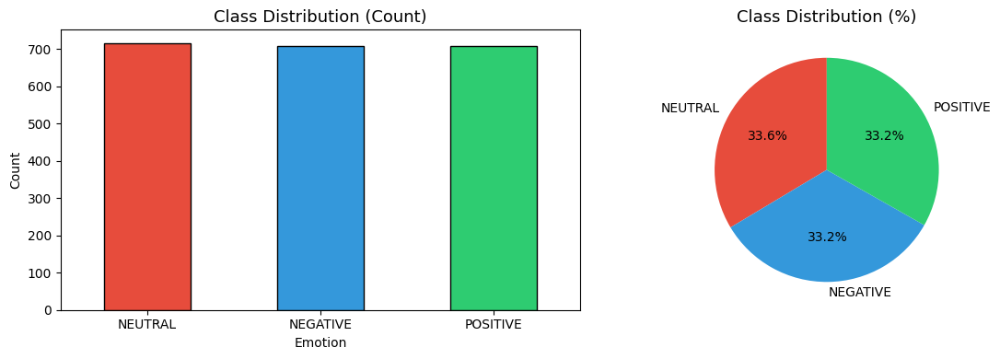
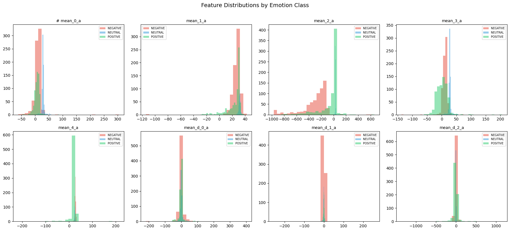
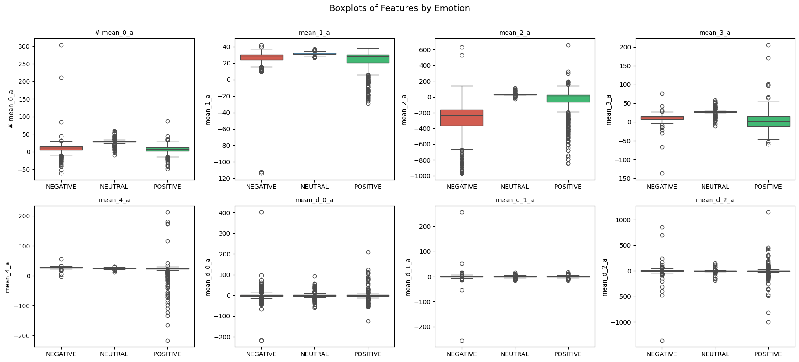
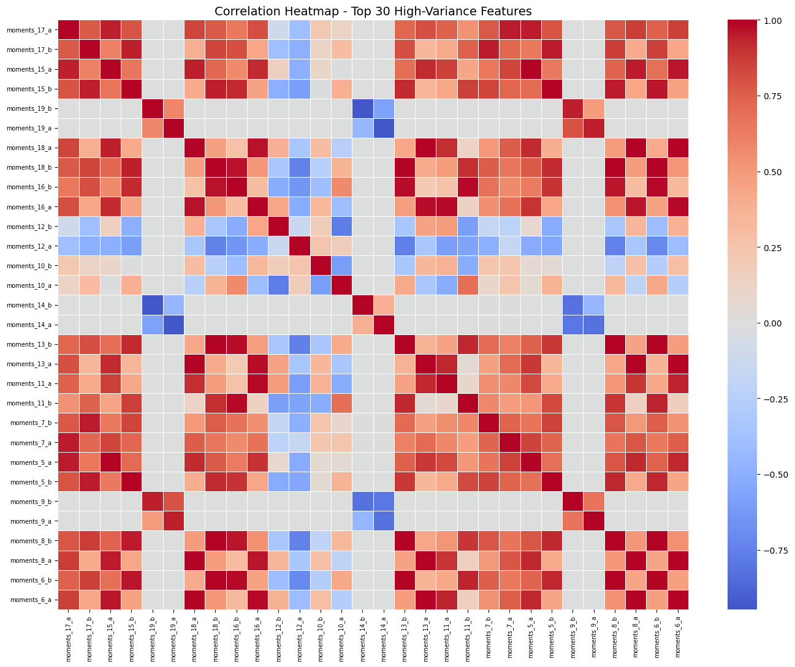
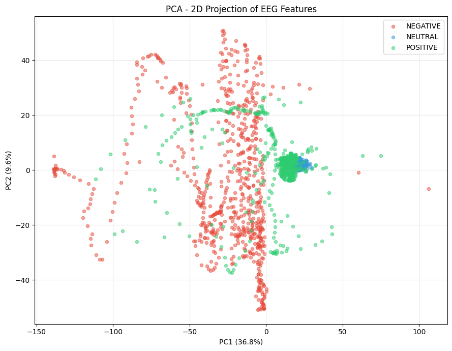
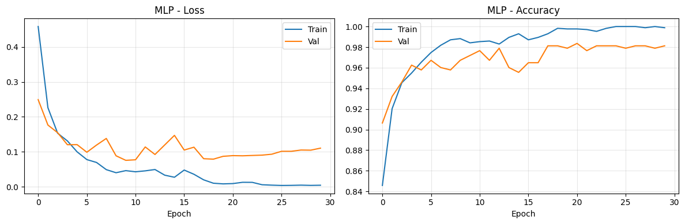
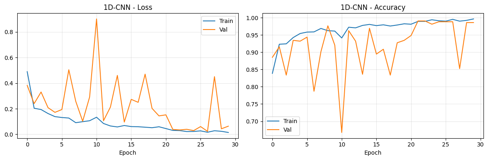
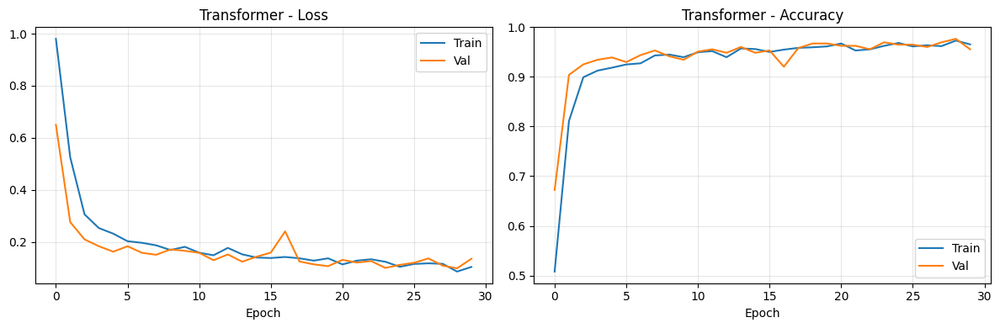
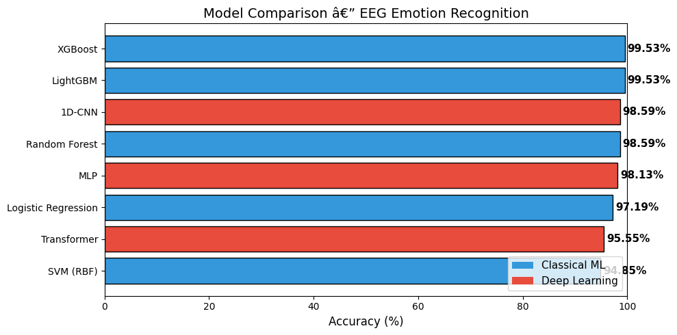
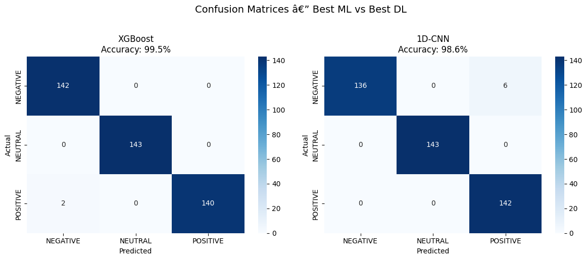

# EEG Emotion Recognition

A machine learning project that classifies emotional states (Positive, Negative, Neutral) from EEG brainwave signals using both classical ML and deep learning models.

---

## Dataset

**Source:** [EEG Brainwave Dataset: Feeling Emotions](https://www.kaggle.com/datasets/birdy654/eeg-brainwave-dataset-feeling-emotions) (Kaggle)

| Property | Value |
|---|---|
| Samples | 2,132 |
| Features | 2,548 |
| Classes | NEGATIVE, NEUTRAL, POSITIVE |
| Missing values | None |
| Class balance | ~716 / 708 / 708 (nearly balanced) |

The features are derived from raw EEG recordings and include:
- **Time-domain statistics** — mean, mean derivative per channel (`mean_0_a`, `mean_d_0_a`, …)
- **Frequency-domain (FFT) coefficients** — `fft_0_b` through `fft_749_b` for two channels

The dataset is **not** included in this repository. Download it from Kaggle and place the file at `data/emotions.csv`.

---

## Project Structure

```
eeg_ml/
├── eeg_emotion_recognition.ipynb   # Main notebook (EDA + all models)
├── main.py                         # Entry point placeholder
├── pyproject.toml                  # Project dependencies (uv)
├── images/                         # Exported figures (used in this README)
└── data/
    └── emotions.csv                # Dataset (download separately)
```

---

## Setup & Usage

### Prerequisites

- Python 3.12+
- [uv](https://github.com/astral-sh/uv) (recommended) or pip

### Clone the repository

```bash
git clone https://github.com/radhika-khatri/eeg_ml.git
cd eeg_ml
```

### Install dependencies

```bash
# Using uv (recommended)
uv sync

# Or using pip
pip install pandas numpy matplotlib seaborn scikit-learn xgboost lightgbm torch torchvision jupyter kagglehub
```

### Download the dataset

```python
import kagglehub
path = kagglehub.dataset_download("birdy654/eeg-brainwave-dataset-feeling-emotions")
# Then copy/move emotions.csv to data/emotions.csv
```

### Run the notebook

```bash
jupyter notebook eeg_emotion_recognition.ipynb
```

---

## Exploratory Data Analysis

### Class Distribution

The dataset is nearly perfectly balanced across the three emotion classes.



### Feature Distributions by Emotion

Distributions of the first 8 time-domain features split by emotion class. Most features show overlapping distributions, making this a challenging classification problem.



### Boxplots by Emotion



### Correlation Heatmap (Top 30 High-Variance Features)

The top high-variance features (mostly FFT coefficients) show strong pairwise correlations, indicating significant redundancy in the feature space.



### PCA — 2D Projection

A 2D PCA projection of the scaled feature space. The three classes are not linearly separable in this projection, which explains why linear models like Logistic Regression still achieve strong but not perfect accuracy.



---

## Models

### Classical ML

All classical models are trained on standardized features (`StandardScaler`), with an 80/20 stratified train/test split.

| Model | Accuracy |
|---|---|
| Logistic Regression | 97.19% |
| SVM (RBF kernel) | 94.85% |
| Random Forest (200 trees) | 98.59% |
| XGBoost | **99.53%** |
| LightGBM | **99.53%** |

### Deep Learning (PyTorch — CPU)

Three architectures were trained for 30 epochs with Adam optimizer and a `ReduceLROnPlateau` scheduler.

| Model | Parameters | Accuracy |
|---|---|---|
| MLP (3 hidden layers: 512→256→128) | 1,471,491 | 98.13% |
| 1D-CNN (3 conv blocks + classifier head) | 174,339 | 98.59% |
| Transformer Encoder (patch-based, 2 layers) | 75,907 | 95.55% |

#### MLP Training Curves



#### 1D-CNN Training Curves



#### Transformer Training Curves



---

## Results

### Model Comparison



| Rank | Model | Accuracy |
|---|---|---|
| 1 | XGBoost | 99.53% |
| 1 | LightGBM | 99.53% |
| 3 | 1D-CNN | 98.59% |
| 3 | Random Forest | 98.59% |
| 5 | MLP | 98.13% |
| 6 | Logistic Regression | 97.19% |
| 7 | Transformer | 95.55% |
| 8 | SVM (RBF) | 94.85% |

### Confusion Matrices — Best ML (XGBoost) vs Best DL (1D-CNN)



### Key Observations

- **Gradient boosting wins overall.** XGBoost and LightGBM both achieve 99.53% — only 2 misclassifications out of 427 test samples.
- **Classical ML beats deep learning here.** With only 2,132 samples and 2,548 tabular features, tree ensembles outperform neural networks. Deep learning typically needs far more data to shine.
- **1D-CNN is the best deep learning model** (98.59%), matching Random Forest, because convolutions naturally capture local feature correlations in the sequential FFT feature layout.
- **The Transformer underperforms** relative to its parameter count. Its patch-based tokenisation (52 features/patch) loses fine-grained local structure that the CNN preserves.
- **MLP is a strong baseline** at 98.13% despite treating all 2,548 features as independent inputs.
- **NEUTRAL is the easiest class** to classify across every model — likely because neutral EEG signals are more homogeneous.
